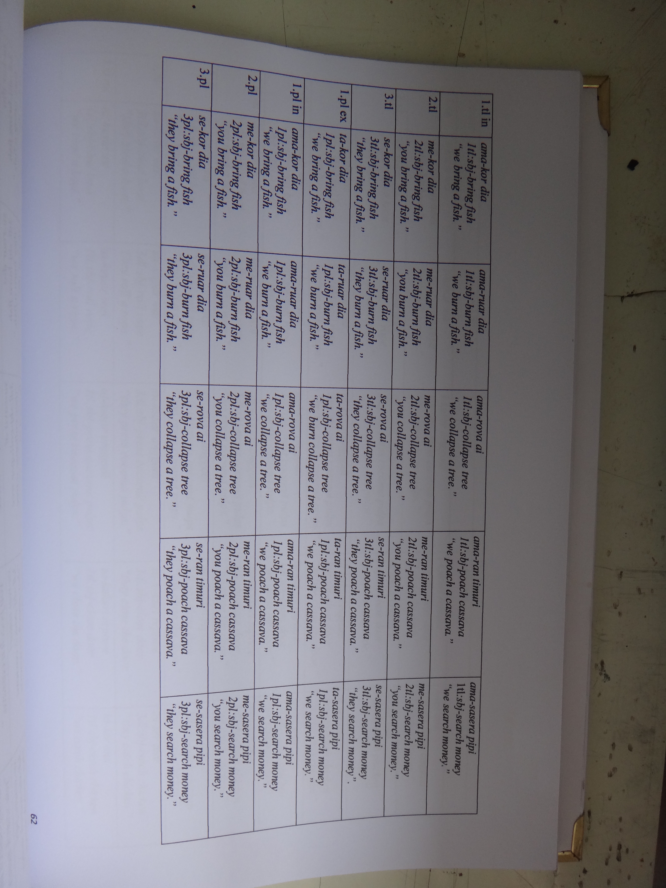
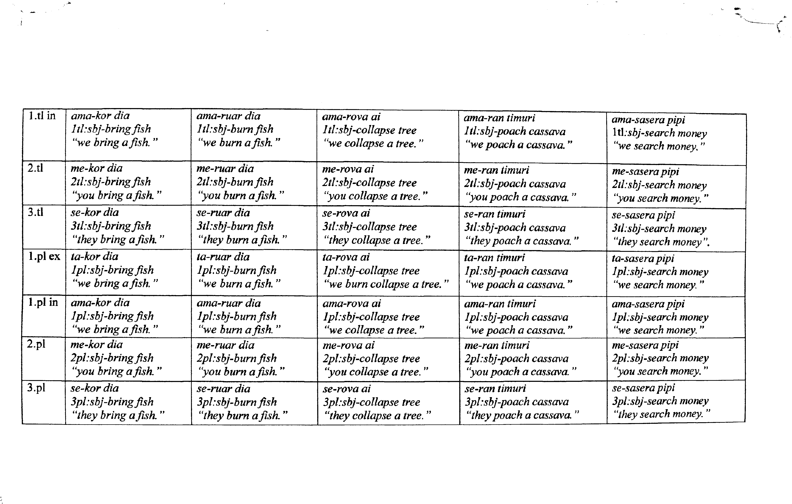

page_dewarp [Python 3]
===========

Page dewarping and thresholding using a "cubic sheet" model - see full writeup at <https://mzucker.github.io/2016/08/15/page-dewarping.html>

Works with:

 - scipy==1.4.1
 - OpenCV 4.6.0 or greater
 - Image module from PIL or Pillow==8.2.0
 
Usage:

    page_dewarp.py IMAGE1 [IMAGE2 ...]

### Result: 
if your input was IMAGE1, the output file will be saved as IMAGE1_thresh.png in the python script's directory.
<h3 align="center">
    
    
</h3>
